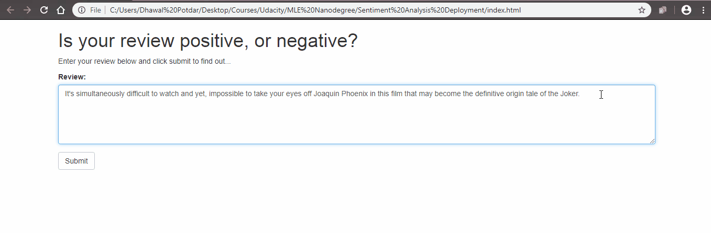

# Sentiment-Analysis-Using-Amazon-SageMaker
This repo contains finished code for the deployment project of Udacity's Machine Learning Engineer Nanodegree.   
This is the workflow followed:
1. Download or otherwise retrieve the data.
2. Process / Prepare the data.
3. Upload the processed data to S3.
4. Train a chosen model.
5. Test the trained model (typically using a batch transform job).
6. Deploy the trained model.
7. Use the deployed model.

## Data
The IMDB Reviews dataset can be downloaded as a `.tar` file from this [link](http://ai.stanford.edu/~amaas/data/sentiment/aclImdb_v1.tar.gz).

## Finished App
#### Following is the schematic layout of the app:
On the far right is the model which is deployed using SageMaker. The model is a custom Pytorch LSTM model. On the far left is the web app that collects a user's movie review, sends it off and expects a positive or negative sentiment in return.
In the middle lies a Lambda function, that can be executed whenever a specified event occurs. This function is given permission to send and recieve data from a SageMaker endpoint.

#### End Product:
An accuracy of 82.9% is achieved.   

